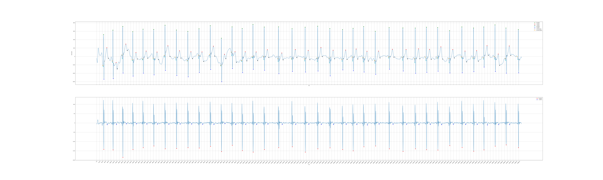
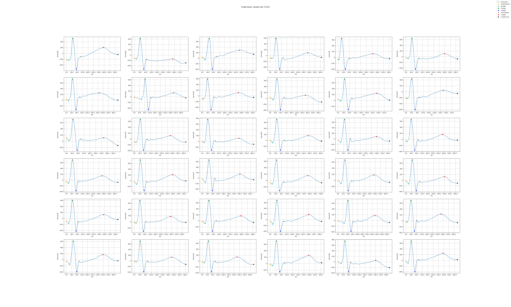
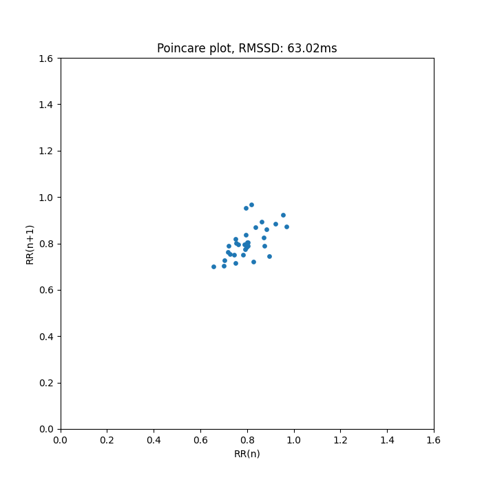
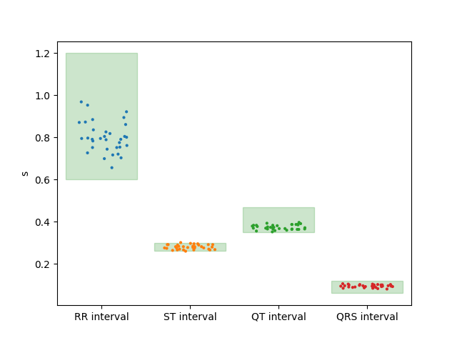

# AppleWatchECG-Insights
Visualization tools for ECG waveform data from apple watch.

## USAGE
Specify in the main function the path to the ECG waveform data file. The data format is the default export format from the Apple Watch Health app.

The program will generate a series of plots and statistics for the ECG waveform data and save them in a folder.
The norm values have been set to the default values for a healthy adult<sup>[[1]](https://www.sciencedirect.com/topics/medicine-and-dentistry/st-segment)</sup><sup>[[2]](https://www.sciencedirect.com/topics/medicine-and-dentistry/qt-interval)</sup> <sup>[[3]](https://www.sciencedirect.com/topics/medicine-and-dentistry/qrs-complex)</sup>. These values can be changed in the main function.

## EXAMPLE
Example of the whole waveform analysis

Example of the single peaks analysis

Example of the poincare variability graph

Example of the analysis graphs


Example of the log file

```
File: ecg_2024-09-12_4.csv
Recorded Date: 2024-09-12 16:43:07 +0200
Classification: Sinus Rhythm
Symptoms: nan
Software Version: 1.90
Device: Watch7,2
Sample Rate: 512 hertz
Lead: Lead I
Unit: �V

avg Frequency: 73.91214683439884

normal RMSSD interval: 19-107ms
RMSSD: 63.02ms

normal RR range: 600.0-1200.0
avg Sinus RR: 800.66ms,
std dev: 71.93ms,
% of out of norm: 0.0%

normal ST range: 260.0-300.0
avg interval ST: 279.47ms,
std dev: 10.8ms,
% of out of norm: 6.06%

normal QT range: 350.0-470.0
avg interval QT: 373.74ms,
std dev: 11.31ms,
% of out of norm: 0.0%

normal QRS range: 60.0-120.0
avg interval QRS: 93.87ms,
std dev: 6.57ms,
% of out of norm: 0.0%
```

## REFERENCES
[1] https://www.sciencedirect.com/topics/medicine-and-dentistry/st-segment

[2] https://www.sciencedirect.com/topics/medicine-and-dentistry/qt-interval

[3] https://www.sciencedirect.com/topics/medicine-and-dentistry/qrs-complex

## DISCLAIMER
This program is not a medical device and should not be used as a diagnostic tool or to make medical decision. If in doubt, consult a medical professional.

